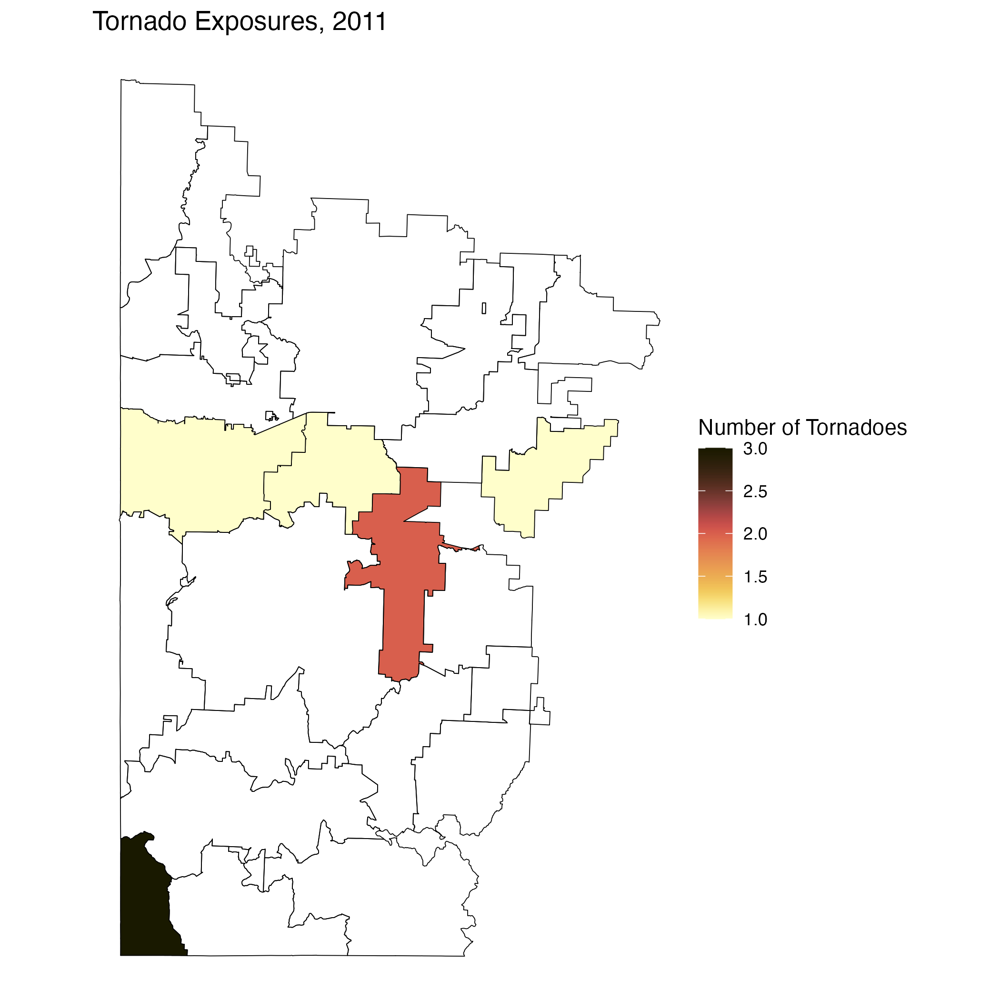
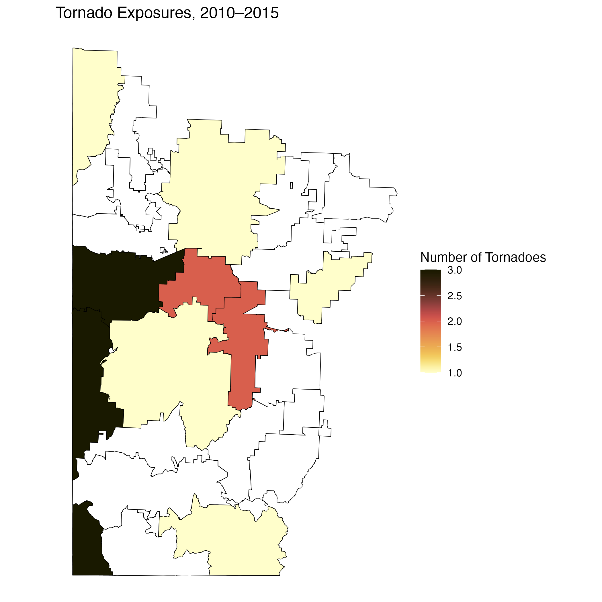
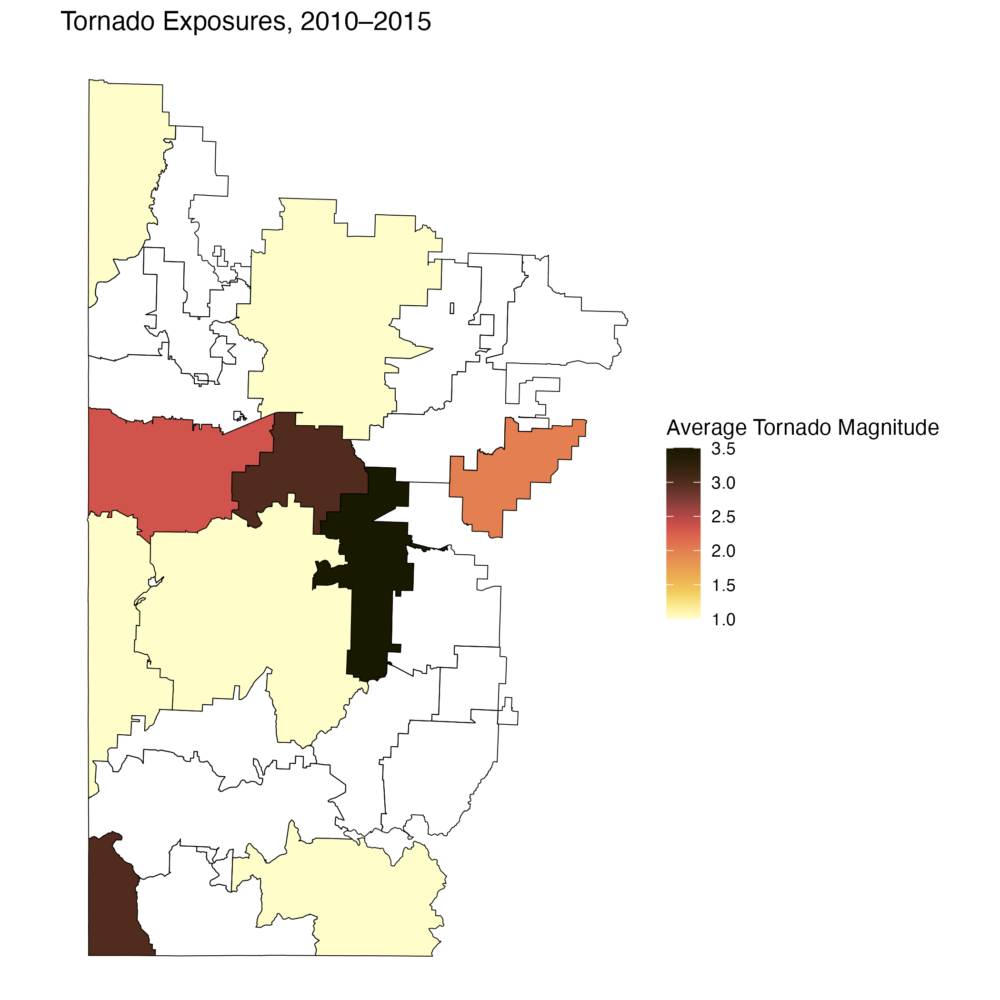
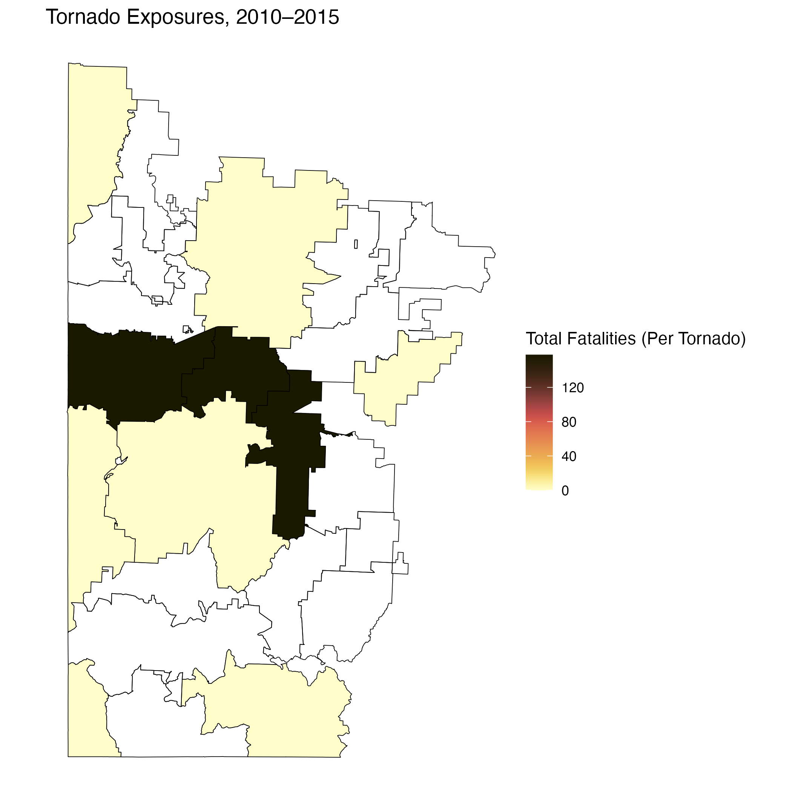
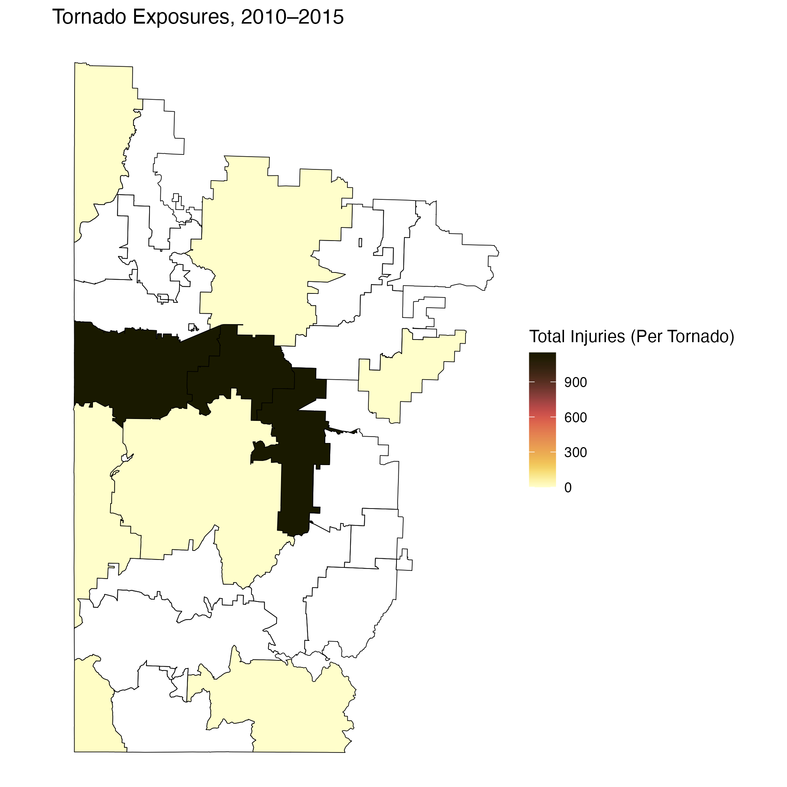
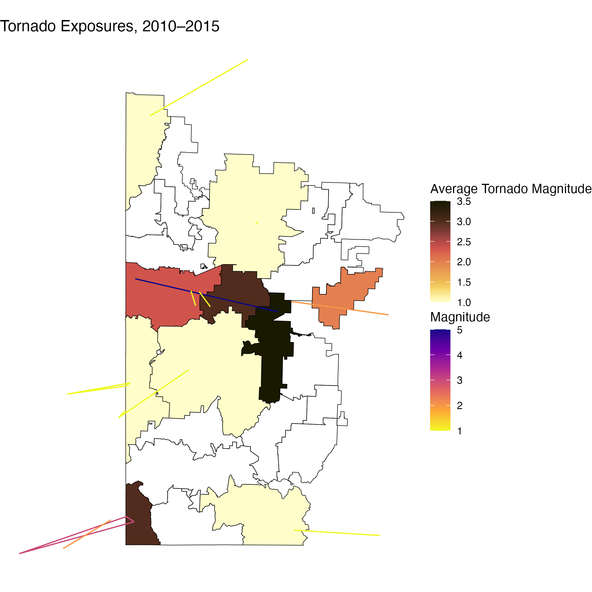

# About the ```tornadoexposure``` package

# How to use the ```tornadoexposure``` package

## Set-up

## Data
This package includes a built-in dataset called ```zcta_tracks```, which is a modified version of the [NOAA Tornado Tracks dataset](https://www.spc.noaa.gov/gis/svrgis/). The dataset retains only tornadoes recorded after 1995 with a magnitude greater than EF0. The raw coordinate data for the tornado tracks was converted into Linestring geometries, which provide the exact locations of and paths taken by each tornado. The data was then merged with ZCTA boundary shapefile data from the Census Bureau, accessed using the ```tigris``` package. The tornado track Linestring geometries were overlaid on top of the ZCTA boundaries to identify which ZCTAs were intersected by each tornado. Finally, the area of the tornado track was compared to the total area of each exposed ZCTA to determine the percentage of ZCTA land area directly affected by each tornado. 

## Functions
All functions in this package require a set of Zip Code Tabulation Area (ZCTA) codes and a range of years across which exposure data should be aggregated. 
ZCTA codes must be passed into the functions as a vector. ZCTA codes can be passed in as any 1-5 digit string of numbers, and the functions will match all ZCTAs that begin with that string of numbers (for instance, pass in the list ```c(6, 4, 2)``` to return exposures affecting all ZCTAs with codes that begin with 6, 4, or 2. Alternatively, pass in the list ```c(60304, 60637)``` to return exposures only affecting ZCTAs 60304 and 60637.) Input lists of ZCTA codes can contain codes of different lengths (eg. ```c(6, 90210, 486)``` would be acceptable input).
Years must be input as a range of integers. Ranges can be as small as a single year (eg. ```2011```) or as large as the full range of years included in the dataset (as of version 0.1.0, ```1996:2025```).

### Getting ZCTA-level exposure data (```get_data```)
Given a list of ZCTA codes and a year or range of years, this function produces a dataframe containing all tornadoexposures recorded in the ZCTAs of interest during the specified timeframe. The output dataframe contains the following exposure characteristics:

| Feature | Data Type | Description |
|---------|-----------|-------------|
| tornado_id | character | A unique string identifying each tornado, comprised of the year of the tornado followed by its NOAA "om"" ID. "om"s are unique within years but not across years, which is why they were combined with year to create this ID.|
| date | date | Date in yyyy-mm-dd format. |
| year | integer |  The year of the tornado. |
| month | character | The month of the tornado in mm format. |
| day | character | The day of the tornado in dd format. |
| magnitude | integer | The magnitude of the tornado on the Enhanced Fujita (EF) scale. Magnitudes for storms recorded prior to the shift from F to EF in 2008 are converted to the EF scale. |
| total_injury | integer | The total number of injuries reported for a given tornado.This count is cumulative for each tornado, and therefore not actually representative of the ZCTA level effects if the tornado affected multiple ZCTAs. |
| total_fatality | integer | The total number of fatalities reported for a given tornado. This count is cumulative for each tornado, and therefore not actually representative of the ZCTA level effects if the tornado affected multiple ZCTAs. |
| area_pct_affected | integer | The percentage of the total ZCTA area that was directly affected by the tornado. |
| ZCTA | character | The 5 digit zip code tabulation area (ZCTA) code. |
| geometry | LINESTRING [m] | A simple features geometry representing the location of and path taken by a given tornado. |

#### Example usage
To view exposures for ZCTAs beginning with the prefix ```648``` between the years 2010 and 2015, you would use the following command:

```
get_data(zcta_list=c(648), 2010:2015)
```

To store that same dataframe as an object to be exported or further manipulated, you would do this:

```
data <- get_data(zcta_list=c(648), 2010:2015)
```

### Mapping ZCTA-level exposures (```map_exposure```)
Given a list of ZCTA codes, a range of years, and the name of an exposure characteristic of interest, this function plots a map of all listed ZCTAs and fills each ZCTA based on the aggregate values of the indicated exposure characteristic. For instance, to visualize the number of tornadoes that occurred in ZCTAs beginning with the prefix ```648``` in the year 2011, you would use the following command:

```
map_exposure(c(648), 2011, "tornado_id")
```
This command would produce the following plot:



```map_exposure``` will automatically return the map when called. If you instead wish to save the output as a plot object (to export or further modify), you can do so with a command such as the following:

```
plot <- map_exposure(c(648), 2011, "tornado_id")
```
If no value is passed in for exposure characteristic, the function will automatically return a blank map containing the boundaries for the requested ZCTA codes.

#### Exposure characteristics
The ```tornadoexposure``` package supports ZCTA-level aggregation and mapping of the following exposure characteristics across input years:

##### Tornado Count
To explore the ZCTA-level count of tornadoes for a given time period, you would input ```"tornado_id"``` as the exposure characteristic of interest. This counts up the total number of unique tornado IDs recorded within each ZCTA across the range of years specified. For example, to visualize the number of tornadoes that occurred in ZCTAs beginning with the prefix ```648``` between the years 2010-2015, you would use the following command:

```
map_exposure(c(648), 2010:2015, "tornado_id")
```
This command would produce the following plot:



##### Average Magnitude
To explore the ZCTA-level average magnitude, as reported on the EF scale, of tornadoes in a given set of ZCTAs, you would input ```"magnitude"``` as the exposure characteristic of interest. For example, to visualize the average magnitudes of tornadoes that occurred in ZCTAs beginning with the prefix ```648``` between the years 2010-2015, you would use the following command:

```
map_exposure(c(648), 2010:2015, "magnitude")
```
This command would produce the following plot:



##### Total Fatalities (per tornado)
To explore the total fatalities per tornado, you would input ```"total_fatality"``` as the exposure characteristic of interest. For example, to visualize the total number of fatalities associated with tornadoes that occurred in ZCTAs beginning with the prefix ```648``` between the years 2010-2015, you would use the following command:

```
map_exposure(c(648), 2010:2015, "total_fatality")
```
This command would produce the following plot:



##### Total Injuries (per tornado)
To explore the total injuries per tornado, you would input ```"total_injury"``` as the exposure characteristic of interest. For example, to visualize the total number of injuries associated with tornadoes that occurred in ZCTAs beginning with the prefix ```648``` between the years 2010-2015, you would use the following command:

```
map_exposure(c(648), 2010:2015, "total_fatality")
```
This command would produce the following plot:



### Mapping tornado tracks (```add_tracks```)
Finally, tornado tracks can be overlaid on any ZCTA-level exposure map created by ```map_exposure```. For instance, if you wanted to overlay the tornado tracks on top of a map showing the average magnitude for all tornadoes affecting ZCTAs beginning with the prefix ```648``` between the years 2010-2015, you would use the following commands:

```
mag_plot <- map_exposure(c(648), 2010:2015, "magnitude")
add_tracks(c(648), 2010:2015, mag_plot)
```
This command would produce the following plot:



If you wish to simply plot the tracks over a blank map of ZCTA boundaries, you can create a blank plot object using ```map_exposure``` without specifying an exposure characteristic, and then pass that into ```add_tracks```.
